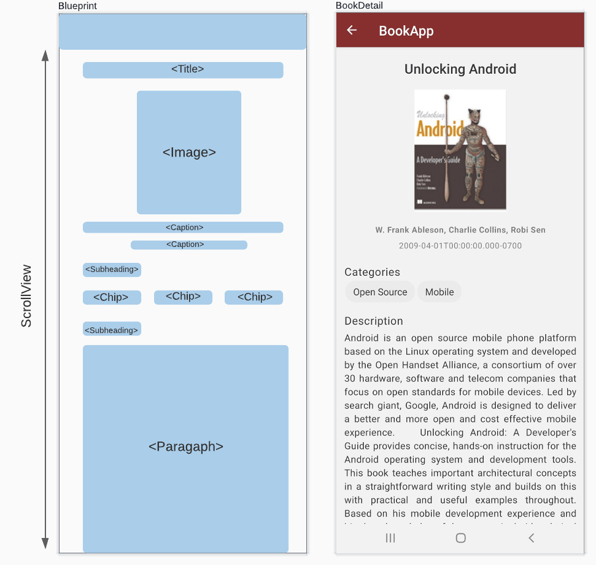

# Exercice 1 : Book details screen

For this exercise, you'll try to get familiar with React Native Paper components.

## Tasks
Try to reproduce the following UI, a blueprint is also provided to guide you in choosing the components you should choose.

