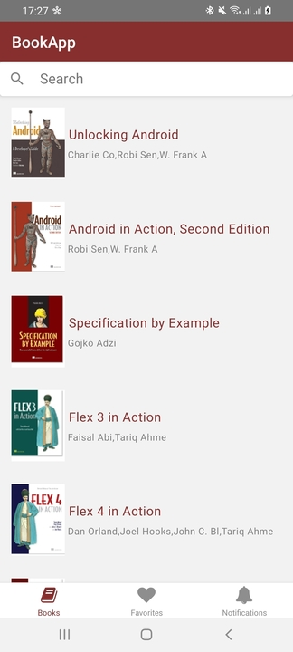

# Exercice 2 : Search in list

The purpose of this exercise, is to add a search bar to the UI, pass the query (search filter) to the store async thunk, and finally know when to reset the list using `useState` and `useEffect` hooks.

## Tasks
Try to reproduce the following UI, this preview shows how the it's supposed to look:

## Guide
You can use the component `Searchbar` from React native paper components, example:

	import * as React from 'react';
	import { Searchbar } from 'react-native-paper';

	const MyComponent = () => {
	  const [searchQuery, setSearchQuery] = React.useState('');

	  const onChangeSearch = query => setSearchQuery(query);

	  return (
	    <Searchbar
	      placeholder="Search"
	      onChangeText={onChangeSearch}
	      value={searchQuery}
	    />
	  );
	};

	export default MyComponent;

