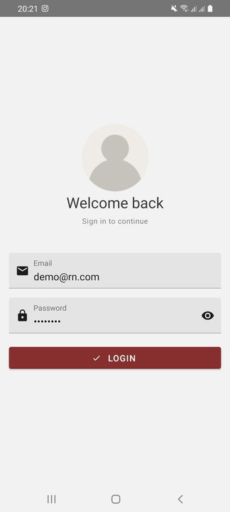

# Exercice 3 : Authentication screen

The purpose of this exercise is to build a feature from end to end (UI, Form, Store, API Call), thus you'll build a login screen.

## Preview

The following preview shows the final result:

## Guide
Here is some considerations to respect when building the login feature:

 - Name of the screen component: **Login**
 - The login form must have 2 fields: **email** and **password**
 - Add a new slice to the store named '**auth**', which has the following properties:
	 - `accessToken` : The access token
	 - `expiresIn` : The access token expiration date time
	 - `userInfo` : User profile informations : {isAuthenticated, firstName, lastName, email}
- Create the necessary actions and selectors.
- Add a new datasource **auth.datasource** which will have 2 function **login** and **register** (Refer to the [BooksAPI Doc](https://books-app-rn.azurewebsites.net/index.html))
- For safe navigation, don't add the login screen to the app navigator, create a new separate stack navigator called **AuthNavigator.** (See next section)

**Note:** Use this email: **demo@rn.com** and the password **Demo@123** for testing login

## Protected Navigation
In this section, we will create a custom hook `useIsAuthenticated`, which provides a boolean indicating whether the user is logged in or not.

### Implement the hook function

1. Create a folder `hooks` inside the folder `src`
2. Create a new file `useIsAuthenticated.js` inside that folder
3. A hook is a function that can return any value, create function `useIsAuthenticated`

		export function useIsAuthenticated() {
		    //code here
		}
		
4. Check the authentication data from the store using `useSelector`

			export function useIsAuthenticated() { 
		    const accessToken = useSelector(AuthSelectors.selectAccessToken)
		    const expiration = useSelector(AuthSelectors.selectTokenExpiration) 
		    return validateToken(accessToken, expiration )
		}
 
	The `validateToken` function, checks the `accessToken` and it's expiration time, if the token exists and valid, then the use is authenticated.

5. In the same file, create the `validateToken` utility function outside the hook

		function validateToken(token, expiresIn) {
		    if (!token || token=="" || !expiresIn) {
		        return false;
		    } 
		    const now = new Date().valueOf();
		    const expirationTime = new Date(expiresIn).valueOf()
		    return expirationTime >= now;
		}

###  Update the entry component `App.js` 

Finally, we just need to use the correct navigator, according to authentication data:
1. Go to `App.js` and add another component outside the app component which checks the authentication using the hook we created:
		
		const ProtectedNavigation = () => {
		  const isAuthenticated  = useIsAuthenticated()
		  return isAuthenticated ? <AppNavigator/> : <AuthNavigator/>
		}
2. Update `App` component

		const App = () => {
		  return (
		    <StoreProvider store={store}>
		      <PaperProvider theme={AppTheme}>
		        <NavigationContainer theme={AppTheme}>
		          <ProtectedNavigation/>  //Change over here
		        </NavigationContainer>
		      </PaperProvider >
		    </StoreProvider>
		  );
		};

